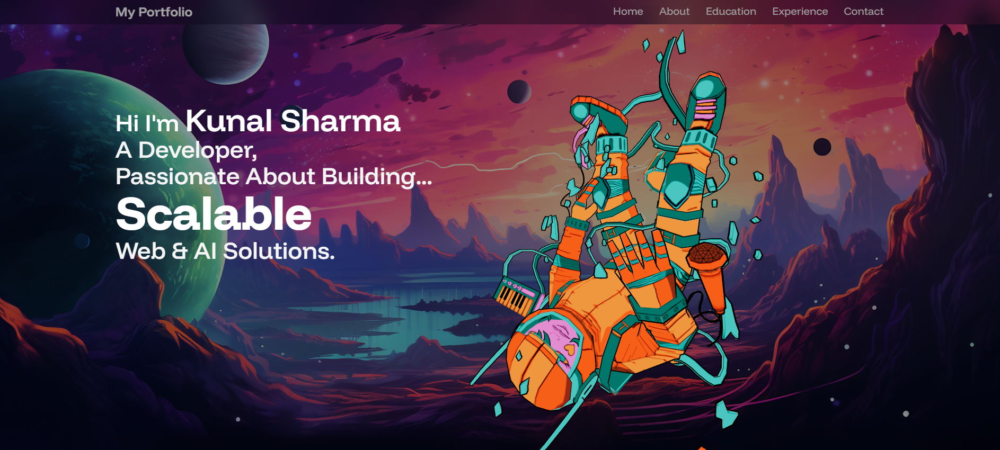
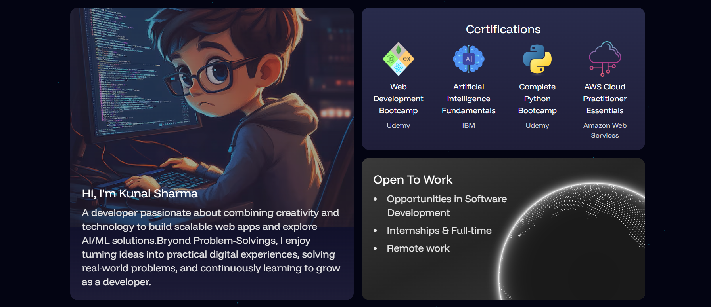

💻Modern 3D developer portfolio built with **React**, **Tailwind CSS**, **Three.js** & **Web API**.  
🚀All 3D scenes and interactions use **@react-three/fiber** (React renderer for Three.js) and **@react-three/drei** (helpers like OrbitControls, Environment, and loaders). The site is responsive, fast, and showcases projects, skills, contact info, and interactive 3D elements.

# Kunal — 3D Portfolio

🌐 **Live Demo:** https://kunal-web.netlify.app

## Screenshots

## Tech Stack
- **Frontend:** React, JavaScript (ES2020+), Tailwind CSS
- **3D & Rendering:** Three.js, **@react-three/fiber**, **@react-three/drei**
- **Web API:** Fetch API / REST API integration for dynamic data
- **Build/Tooling:** Vite, ESLint, Prettier
- **Deployment:** Netlify

## Features
- Responsive, mobile-first UI with Tailwind CSS
- Interactive 3D models/scenes (orbit/pan/zoom)
- Smooth scrolling and section-based navigation
- Projects, Skills, and Contact sections
- Fast builds and automatic deploys via Netlify

## Getting Started
# install deps
npm install

# start dev server
npm run dev

## License
This project is licensed under the [MIT License](./LICENSE) © 2025 Kunal.

